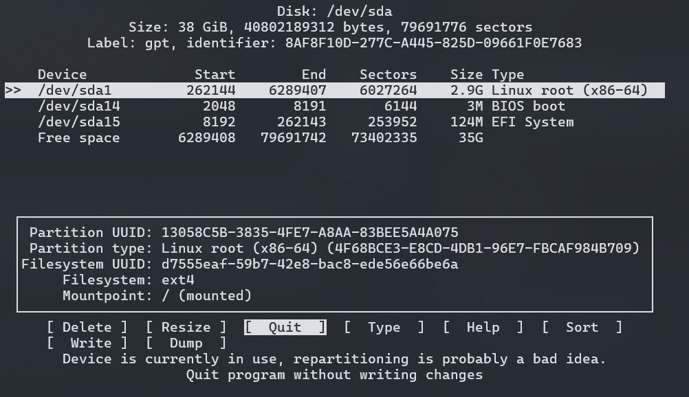
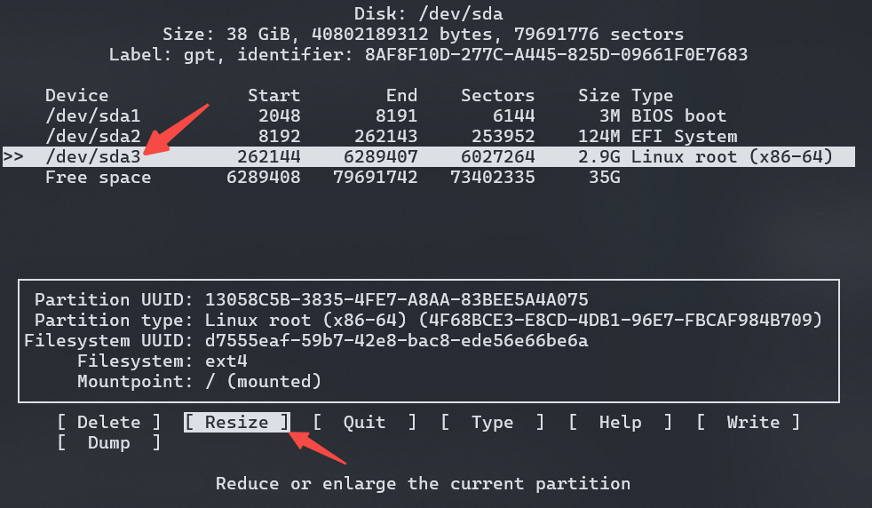
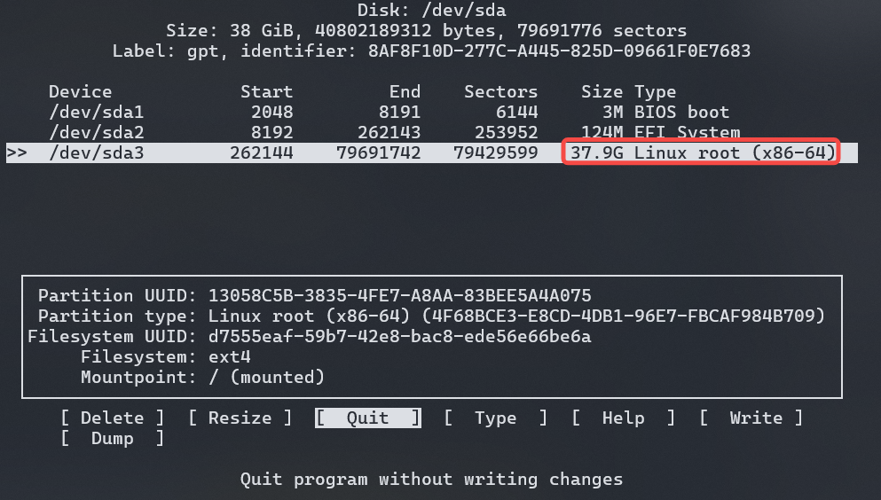

# Rust for Linux Wiki

在本项目的 Wiki 的整个栏目中，主要聚焦于 Rust for Linux 的所有代码实现。同时，Wiki 栏目会着重介绍 Rust for Linux 当前每一个模块的功能并随着版本实时更新。

在这之前，我们需要准备一个能够运行 Rust for Linux 代码的环境。在正式开始之前，这里统一介绍笔者当前的系统环境：

``` bash
OS: Fedora 42 (Server Edition)
Gcc: gcc version 15.2.1 20251022 (Red Hat 15.2.1-3) (GCC)
Clang: clang version 20.1.8 (Fedora 20.1.8-4.fc42)
Rust: rustc 1.91.0 (f8297e351 2025-10-28)
LLVM: LLVM version 20.1.8
LLD: LLD 20.1.8 (compatible with GNU linkers)
```

## Rust for Linux 环境搭建

我们需要搭建一个 Rust for Linux 环境，我们就需要编译内核，然后通过 QEMU 运行所编译的内核镜像。为了方便起见，除了 QEMU 和 Linux 镜像文件，其余文件均采用已经处理好的网络资源文件(rootfs和disk image)。

### 安装 Rust

在 Rust for Linux 的[官方文档](https://docs.kernel.org/rust/quick-start.html)中，Rust 的安装是通过各自发行版本的包管理器进行统一安装，但笔者是通过 Rust 官方安装脚本进行安装，**只需要保证 \\( rust \ version \ge 1.80 \\) 即可**。

因此，此处仅提供通过 Rust 官方安装脚本的方式：

> 对于国内用户，可以采用[rsproxy](https://rsproxy.cn/)更换镜像源后进行安装

``` bash
curl --proto '=https' --tlsv1.2 -sSf https://rsproxy.cn/rustup-init.sh | sh
```

安装完成后，查看安装信息以确保 Rust 版本大于`1.80`版本。

``` bash
rustc --version
rustc 1.91.0 (f8297e351 2025-10-28)
```

当然，你可以可以通过如下代码进行简单验证：

``` rust
# fn main() {
    println!("Hello Rust Version Done! Verison: {:?}", std::env::var("CARGO_PKG_VERSION"))
# }
```

通过官方安装脚本安装时，通常也会安装`rustfmt`和`rust-clippy`。为了确认是否安装成功，请使用如下命令进行检测：

``` bash
rustfmt --version
rustfmt 1.8.0-stable (f8297e351a 2025-10-28)

cargo clippy --version
clippy 0.1.91 (f8297e351a 2025-10-28)
```

如若没有安装，请通过如下指令进行安装：

``` bash
rustup component add rust-src rustfmt clippy
```

针对于 Rust for Linux 开发，还需要额外安装`bindgen`，这用于 Rust 与 C语言之间的通信。

``` bash
cargo install --locked bindgen-cli
```

### 安装 QEMU

在后续的启动中，我们通过 Qemu 进行启动对应的镜像文件，因此需要提前准备 Qemu 可执行程序。

对于 Qemu 的安装而言，通常分为两种方式：包管理安装和手动编译。笔者通常喜欢手动编译，但下方会给出两种安装方式，读者可以自行选择其中一种进行安装。

#### 包管理安装

包管理安装可以直接通过各自的系统命令进行安装，下方给出两种常见发行版本安装命令：

- Ubuntu/Debian(全量安装)

``` bash
sudo apt install qemu -y
```

- Ubuntu/Debian(精简安装)

``` bash
sudo apt install qemu-system-x86 -y
```

- Fedora/Rocky(全量安装)

``` bash
sudo dnf install qemu -y
```

- Fedora/Rocky(精简安装)

``` bash
sudo dnf install qemu-system-x86 -y
```

#### 源码编译安装

这里简单阐述一下为什么选择源码编译，因为源码编译可以自行选择安装版本，避免版本过久问题。

首先安装所需的依赖包:

``` bash
sudo dnf in ninja-build python3-sphinx python3-sphinx_rtd_theme glib2-devel libslirp-devel -y
```

然后下载对应的源码并解压：

``` bash
wget https://download.qemu.org/qemu-10.1.2.tar.xz
tar Jxvf qemu-10.1.2.tar.xz
```

进入对应的目录进行配置：

``` bash
./configure --prefix=/opt/qemu --enable-kvm --enable-debug
make -j$(nproc)
```

> 精简安装：本教程主要在`x86`环境上进行操作，因此如果读者的资源有限或认为全量编译过慢，可以通过下方指令进行精简编译  
> ``` bash
> ./configure --prefix=/opt/qemu --target-list=x86_64-softmmu --enable-kvm
> ```

编译完成后，安装到指定目录，并配置环境变量；然后进行验证：

``` bash
sudo make install
echo "export PATH=$PATH:/opt/qemu/bin" >> $HOME/.bashrc
source $HOME/.bashrc

qemu-system-x86_64 --version
QEMU emulator version 10.1.2
Copyright (c) 2003-2025 Fabrice Bellard and the QEMU Project developers
```

### 构建 Linux 镜像

提前准备好 Linux 编译所需要的依赖包:

``` bash
sudo dnf in gcc clang clang-tools-extra llvm lld gpg2 git gzip make openssl perl rsync binutils ncurses-devel flex bison openssl-devel elfutils-libelf-devel rpm-build
```

准备好 Rust 环境后，我们就需要通过编译内核源码获取 Linux 镜像文件。首先，我们直接克隆 Rust for Linux 主线分支(**Linux内核主线源码也是可行的，只是相较于 Rust for Linux 主线分支支持的特性稍微少一些**)。

``` bash
git clone https://github.com/Rust-for-Linux/linux.git rust-for-linux --depth=1
```

进入到`rust-for-linux`目录中(这里将 Rust for Linux 主线代码重命名为`rust-for-linux`这是为了避免与`linux`内核主线重名)。然后通过如下命令检查 Rust 依赖和版本是否正确。

> **极其要注意的是，对于 Rust for Linux 的编译，LLVM 工具链的版本必须要 \\( \ge 15.0.0 \\)**

``` bash
make LLVM=1 rustavailable
Rust is available!
```

只有输出结果为`Rust is available!`时，才证明当前主机环境能够正常通过 Rust 编译内核。现在，我们就可以开始编译 Rust for Linux 的内核源码。

``` bash
make LLVM=1 defconfig
make LLVM=1 menuconfig
```

首先通过`defconfig`命令生成默认配置文件，然后通过`menuconfig`启用`RUST`和`SAMPLES_RUST`，其参数选择位置参考下方：


``` bash
config RUST
Location:
  -> General setup
    -> Rust support (RUST [=y])

config SAMPLES_RUST 
Location:
  -> Kernel hacking
    -> Sample kernel code (SAMPLES [=y])
      -> Rust samples (SAMPLES_RUST [=y])
```

配置完成后，就能够正常启用 Rust 进行编译内核，然后开始编译。

``` bash
make LLVM=1 -j$(nproc)
```

在编译时，可以通过编译的日志查看到一些 Rust 编译信息：

``` bash
  RUSTC L rust/core.o
  BINDGEN rust/bindings/bindings_generated.rs
  BINDGEN rust/bindings/bindings_helpers_generated.rs
  CC      rust/helpers/helpers.o
  RUSTC P rust/libpin_init_internal.so
  RUSTC P rust/libmacros.so
```

> **对于 Rust 是必须开启 `LLVM=1` 选项的，因此不能够省略，如果想要省略，可以在编译配置千使用如下命令**:
> ``` bash
> export LLVM=1
> ```

编译完成后，读者可以在当前目录下查看到对应的生成镜像文件，我们所需要使用的则是 `vmlinux`。然后我们进入下一步，准备启动环境。

### 运行 Rust for Linux 镜像

之前提到，为了简化流程，我们会直接从网络上下载已有镜像进行运行，因此需要运行如下命令：

``` bash
wget https://cdimage.debian.org/images/cloud/bookworm/20250316-2053/debian-12-nocloud-amd64-20250316-2053.qcow2 -o debian-12.qcow2
```

> 如果想要下载其他架构，请参考最下方的参考链接中的 Rust Exercises Ferrous System

为了简化下载的方便，所下载的镜像的大小不会太大，因此内部的空间不足以让我们后续替换内核镜像和加载内核模块。所以在启动之前需要进行扩容，启动后在内部修改磁盘大小以支持镜像更换。

``` bash
(host-machine) qemu-img resize debian-12.qcow2 +32G
```

至此，前期的准备工作均准备完毕，运行如下命令启动镜像：

``` bash
(host-machine) qemu-system-x86_64 -m 8G -M q35 -accel kvm -smp 8 \
  -hda debian-12.qcow2 \
  -device e1000,netdev=net0 \
  -netdev user,id=net0,hostfwd=tcp:127.0.0.1:5555-:22 \
  -nographic \
  -serial telnet:localhost:4321,server,wait
```

此时，该终端会一直挂起，读者需要另起一个新终端，通过 `telnet` 命令进行连接：

``` bash
telnet localhost 4321
[  OK  ] Finished systemd-user-sess…ervice - Permit User Sessions.
[  OK  ] Started getty@tty1.service - Getty on tty1.
[  OK  ] Started serial-getty@ttyS0…rvice - Serial Getty on ttyS0.
[  OK  ] Reached target getty.target - Login Prompts.
[  OK  ] Started dbus.service - D-Bus System Message Bus.
[  OK  ] Started systemd-logind.service - User Login Management.
[  OK  ] Started unattended-upgrade…0m - Unattended Upgrades Shutdown.
[  OK  ] Finished e2scrub_reap.serv…ine ext4 Metadata Check Snapshots.
[  OK  ] Reached target multi-user.target - Multi-User System.
[  OK  ] Reached target graphical.target - Graphical Interface.
         Starting systemd-update-ut… Record Runlevel Change in UTMP...
[  OK  ] Finished systemd-update-ut… - Record Runlevel Change in UTMP.

Debian GNU/Linux 12 localhost ttyS0

localhost login:
```

此时，就启动了对应的内核镜像，通过 `root` 用户登录(无密码)。当前启动的内核是自带内核，因此需要更换内核镜像。在这之前，我们还需要进行扩容操作，并且需要配置好 `ssh` 以方便将内核镜像传入到虚拟机中。

``` bash
(virt-machine) uname -a
Linux localhost 6.1.0-32-amd64 #1 SMP PREEMPT_DYNAMIC Debian 6.1.129-1 (2025-03-06) x86_64 GNU/Linux

(virt-machine) apt update
(virt-machine) apt install fdisk
(virt-machine) cfdisk /dev/*da
```



执行上述命令后，可以看到如上所示的界面。首先选择 `Sort`，此时你会发现 `Linux root` 往下移动，与 `Free space` 近邻，然后如下所示，选择 `Linux root` 对应的磁盘，并且选择 `Resize` 选项。



然后键入两次回车，发现 `Linux root` 的大小更改后，选择 `Write` 选项，然后键入 `yes` 确定修改，如下所示:



至此，选择 `Quit` 选项即可，使用 `reboot` 重启虚拟机，查看是否更改成功：

``` bash
(virt-machine) reboot

(virt-machine) df -h
Filesystem      Size  Used Avail Use% Mounted on
...
/dev/sda3        38G  1.2G   35G   4% /
...
```

修改完成后，接下来需要配置 `ssh`：

``` bash
(virt-machine) apt install openssh-server
```

并将主机的 `ssh` 公钥复制到虚拟机中的 `.ssh/authorized_keys` 文件中。接着将上方我们编译的内核传入到虚拟机中：

``` bash
(host-machine) scp -P 5555 rust-for-linux/vmlinux root@localhost:/root
```

此时，能够在虚拟机中发现对应的文件，将其添加可执行文件权限，并移动到 `/boot` 下

``` bash
(virt-machine) chmod +x vmlinux
(virt-machine) cp /boot/vmlinuz-6.1.0-32-amd64 /boot/vmlinuz-6.1.0-32-amd64-bak
(virt-machine) cp vmlinux /boot/vmlinuz-6.1.0-32-amd64
(virt-machine) reboot
```

重启后，如无任何报错信息，则更换内核完毕，通过如下命令查看：

``` bash
(virt-machine) uname -a
```

至此，启动一个 Rust for Linux 编译的内核镜像就成功完成了。

---

参考链接

- [Rust Exercises Ferrous System](https://rust-exercises.ferrous-systems.com/latest/book/building-linux-kernel-driver)
- [Rust for Linux Quick Start](https://docs.kernel.org/rust/quick-start.html)
